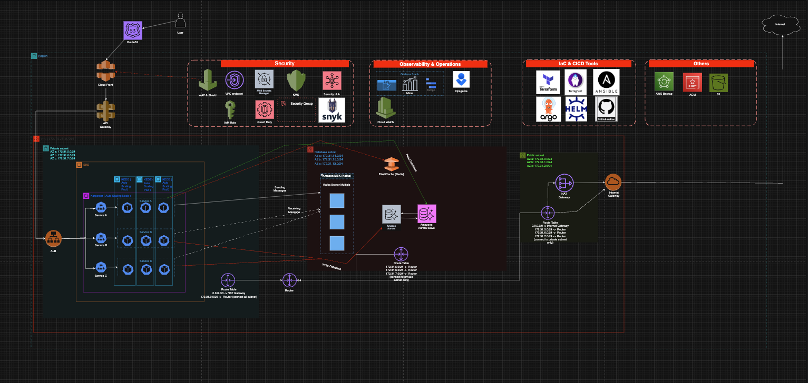

# SOLUTION 2

## 1. System Architecture Overview

* **Network Topology**: Multi-AZ deployment (AZ A, B, and C) to ensure 99.99% availability.
* **Architecture Pattern**: Event-Driven Microservices using **Amazon MSK** as the message backbone.
* **Data Layer Separation**: Multi-tier subnets including Public (Edge), Private (App), and Isolated (Data).

## 2. Tech Stack & Service Rationale

| Service / Tool | Reason for Selection & Specific Role | Alternatives & Senior Insights |
| :--- | :--- | :--- |
| **Route 53** | Global DNS management with latency-based routing to ensure users connect to the nearest endpoint. | **Cloudflare DNS**: Competent, but Route 53 supports Alias Records to ALB/CloudFront without internal query charges. |
| **CloudFront** | Caches static content (Web UI) at Edge Locations and serves as the first line of defense against DDoS. | **Akamai**: High performance, but CloudFront integrates natively with ACM for free SSL/TLS management. |
| **ACM (AWS Certificate Manager)** | Automatically provisions and manages SSL/TLS certificates for CloudFront and ALB, ensuring full HTTPS encryption. | **Let's Encrypt**: Requires manual/scripted rotation; ACM handles auto-renewal seamlessly with Route 53. |
| **AWS WAF & Shield** | Mitigates Layer 7 attacks (SQLi, XSS) and protects against large-scale infrastructure DDoS. | **Cloudflare WAF**: Robust, but AWS WAF allows for granular rules based on real-time CloudWatch logs. |
| **API Gateway** | Manages endpoints, handles Cognito authentication, and maintains WebSockets for real-time market data. | **Kong API Gateway**: Better for plugin extensibility and hybrid-cloud, but requires self-management on EKS. AWS API Gateway is Serverless and scales automatically. |
| **VPC Endpoint (Interface & Gateway)** | Enables private, high-performance connectivity to AWS services (S3, Secrets Manager, MSK) via the AWS private backbone. Eliminates data transfer through the public internet and bypasses NAT Gateway bottlenecks. | **PrivateLink**: Use for 3rd-party services to keep traffic internal. **Egress-Only IGW**: Use for IPv6-only egress traffic to save costs while maintaining security. VPC Endpoints are preferred for p99 <100ms targets. |
| **ALB (External/Internal)** | Intelligent L7 load balancing; Internal ALB secures and coordinates traffic between microservices. | **NLB**: Faster, but lacks HTTP-specific features like Sticky Sessions or Header-based routing. |
| **NAT Gateway** | Enables resources in Private Subnets to download updates or connect externally in a controlled manner. | **NAT Instance**: Cheap but a "single point of failure"; NAT Gateway is a highly available managed service. |
| **EKS (Kubernetes)** | Orchestrates complex microservices with industry-standard APIs. Essential for Multi-cloud strategies and advanced traffic management (Service Mesh). | **AWS ECS**: Simpler and deeply integrated with AWS, but results in high **Vendor Lock-in**. EKS is preferred for its superior **Portability** and rich **CNCF Ecosystem** which allows for more granular resource isolation compared to ECS Tasks. |
| **Karpenter** | Automates Worker Node provisioning based on real-time Pod requirements, significantly faster than Cluster Autoscaler. | **Cluster Autoscaler**: Slower (2-3 mins to add a node); Karpenter typically provisions in under 1 minute. |
| **KEDA** | Scales Pods based on external events, such as message lag in the Kafka topics. | **HPA (CPU/RAM)**: Doesn't reflect real trading load; KEDA scales based on actual order backlog. |
| **Istio (Service Mesh)** | Manages internal traffic, enforces mTLS between services, and supports Canary Deployments. | **Linkerd**: Lighter, but Istio offers a richer feature set for managing complex system policies. |
| **Amazon MSK (Kafka)** | Ingests and distributes trade orders in an Event-driven model, ensuring data integrity. | **RabbitMQ**: Difficult to guarantee order at scale; Kafka excels in persistence and event replay. |
| **ElastiCache (Redis)** | Stores the Orderbook in-memory for sub-millisecond order matching by the Matching Engine. | **Memcached**: Lacks advanced data structures like Sorted Sets required for order priority. |
| **Aurora PostgreSQL** | Durable storage for wallet balances and trade history with Multi-AZ auto-failover. | **RDS Postgres**: Slower failover time (~30-60s) compared to Aurora's (~10-30s). |
| **Amazon S3** | Stores application logs (via Loki) and static images (KYC/Assets) with 99.999999999% durability. | **Amazon EBS**: Optimized for high-speed disk I/O but significantly more expensive for cold logs and non-shareable between nodes (ReadWriteOnce). S3 is the industry standard for Loki's "Chunk" storage. |
| **AWS Backup** | Centralized backup service to automate data protection for Aurora, MSK, EBS. | **Manual Snapshots**: Harder to manage; AWS Backup ensures consistent compliance and retention policies. |
| **Secrets Manager** | Centralized storage and automatic rotation of Database passwords and mapping into secret in EKS. | **Parameter Store**: Free, but lacks native automatic password rotation for Databases. |
| **AWS KMS** | Manages encryption keys for data-at-rest across EBS volumes, RDS, and S3 buckets. | **CloudHSM**: Higher physical security but significantly more expensive; only needed for specific compliance. |
| **Security Hub** | Centralized security management hub that aggregates alerts from GuardDuty and checks compliance. | **Azure Security Center**: Only for multi-cloud; Security Hub is optimized for pure AWS environments. |
| **GuardDuty** | AI-powered threat detection; alerts on suspicious login behavior or crypto-mining in the cluster. | **Traditional IDS/IPS**: High overhead; GuardDuty is agentless and does not impact system performance. |
| **IAM Role** | Enforces granular access for Services/Pods, strictly following the Principle of Least Privilege. | **IAM User**: Insecure due to static keys; Roles use Temporary Credentials and are much safer. |
| **Snyk** | Scans for vulnerabilities in code and container images within the CI/CD pipeline. | **SonarQube**: Focused on code quality; Snyk is stronger for real-world security vulnerability databases. |
| **Grafana / Mimir** | Visualizes dashboards and provides long-term metrics storage for the entire stack. | **Datadog**: Excellent but becomes prohibitively expensive as metric volume scales. |
| **Loki** | High-efficiency log aggregation inspired by Prometheus, drastically reducing storage costs. | **ELK Stack**: Resource-heavy (RAM/Storage) due to indexing; Loki is much more resource-efficient. |
| **Tempo** | Distributed tracing solution to track the journey of a transaction across microservices. | **Jaeger**: Popular, but Tempo integrates seamlessly within the Grafana LGTM ecosystem. |
| **Opsgenie** | Incident management that handles on-call schedules and alerts engineers via call/SMS. | **PagerDuty**: Comparable features; Opsgenie often has more competitive pricing. |
| **Terraform / Terragrunt** | Defines Infrastructure as Code (IaC); Terragrunt keeps code "DRY" and manageable. | **CloudFormation**: AWS-locked; Terraform allows expansion to other providers like Cloudflare. |
| **ArgoCD** | GitOps-based deployment that automatically syncs the K8s cluster with the Git source of truth. | **FluxCD**: Comparable, but ArgoCD's UI is superior for observing application health. |
| **GitHub Actions** | Automates Build, Test, and Push processes for the CI pipeline. | **Jenkins**: High operational overhead; GitHub Actions is a managed service integrated with the code. |

## 3. Key Technical Solutions

### 3.1. Low Latency (p99 < 100ms)
* **In-Memory Matching**: Utilizing **ElastiCache Redis** for the orderbook to avoid disk I/O bottlenecks.
* **Internal Communication**: Using **Istio Service Mesh** and **Internal ALB** for optimized service-to-service traffic.
* **Edge Optimization**: **Global Accelerator** to reduce jitter and latency for international traders.

### 3.2. High Availability & Resilience
* **Self-Healing**: **EKS** automatically restarts failed pods; **Karpenter** replaces unhealthy nodes.
* **Data Durability**: **Aurora Multi-AZ** with read replicas for instant failover (<30s) and **AWS Backup** for point-in-time recovery.
* **Network Safety**: **VPC Endpoints** ensure traffic to AWS services (like S3 or Secrets Manager) never leaves the private network.

### 3.3. Security & Compliance
* **Zero Trust**: Implementation of **IAM Roles for Service Accounts (IRSA)** and strict **Security Groups**.
* **Proactive Defense**: **GuardDuty** for threat detection and **Snyk** for container/code vulnerability scanning.

## 4. Disaster Recovery (DR) Strategy

### 4.1. Automated Recovery with IaC & GitOps
The entire infrastructure and application stack are managed 100% via IaC, ensuring rapid environment replication in a secondary DR Region:
* **Infrastructure**: Provisioned using **Terraform** and **Terragrunt** for modularity and environment consistency.
* **Configuration**: OS-level and middleware tuning are automated via **Ansible**.
* **Application Layer**: All microservices are packaged as **Helm Charts** and continuously delivered by **ArgoCD**.
* **Recovery Time**: This automated pipeline allows for a full regional stand-up of the compute and networking layer within **2-3 hours** from scratch.

### 4.2. Data Persistence & Synchronization
We offer two primary tiers for data recovery based on business criticality:

#### Option A: Cost-Optimized (AWS Backup)
* **Mechanism**: Use **AWS Backup** to create cross-region automated backups for **Amazon Aurora**, **Amazon MSK**, and **EBS volumes**.
* **Best for**: Non-critical environments or early-stage startups where cost control is prioritized over near-zero downtime.

#### Option B: High-Performance (Aurora Global Database & MSK Replication)
* **Mechanism**: Leverage **Amazon Aurora Global Database** for storage-based replication with latency < 1 second.
* **Benefit**: Eliminates the need for traditional backup-restore cycles for the database, allowing for near-instant regional failover.

### 4.3. Recovery Objectives (RTO & RPO)

Based on the proposed architecture, here are the estimated metrics to help define the final SLA:

| Metric | Pilot Light (AWS Backup) | Warm Standby (Global Database) |
| :--- | :--- | :--- |
| **RPO (Recovery Point Objective)** | **15 - 30 minutes** (Based on backup frequency) | **< 1 second** (Real-time data replication) |
| **RTO (Recovery Time Objective)** | **2 - 4 hours** (Time to stand up infra + restore data) | **< 15 minutes** (Only DNS/Traffic switch-over) |

### 4.4. Recommendation for Master Solution
To balance cost and performance for a Binance-like platform, I recommend the **Pilot Light** strategy initially:
1. Keep the **VPC and IAM** pre-provisioned via **Terraform** in the DR region.
2. Use **Aurora Global Database** for the Core Wallet/Trade data to achieve near-zero **RPO**.
3. Scale the **EKS Cluster** and **MSK** only during a disaster event using **Terragrunt** and **ArgoCD** to minimize daily running costs while keeping **RTO** within 2 hours.
